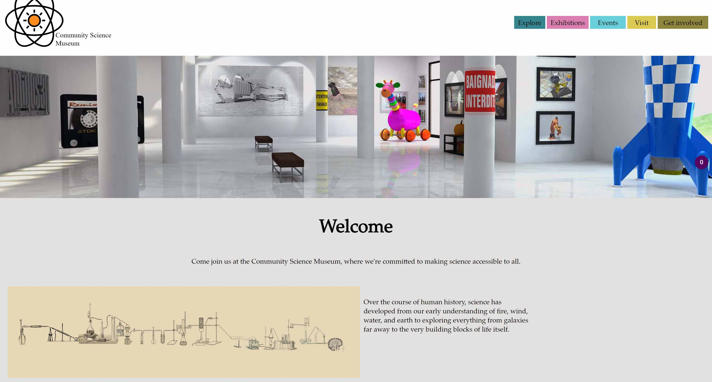

# Community Science Museum

## Description

- My motivation for this project was to learn how to make a website with easy-to-find information and make a design that appeals to both young and old.

- I build this website so I could learn more about how to code and make the website accessible for everyone.

- On this website, you can find information about the museum and how you can contact them.

- In this project, I learned how to build a user-friendly, clean and neat website.

## Built with

- HTML
- CSS

## Contributing

If you want to contribute to this blog, here are the steps you should follow:

1. Fork the project to your own GitHub profile.
2. Clone the fork on your local machine.
3. Create a branch where you will push your code.
4. Make changes - Comment the changes you do.
5. Push changes to GitHub.
6. Create a pull request for merge.

## Contact

If you want to contact me, here is my information:

[My LinkedIn page](http://www.linkedin.com/in/mona-dagsland-56ba85226)
